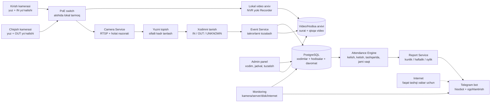
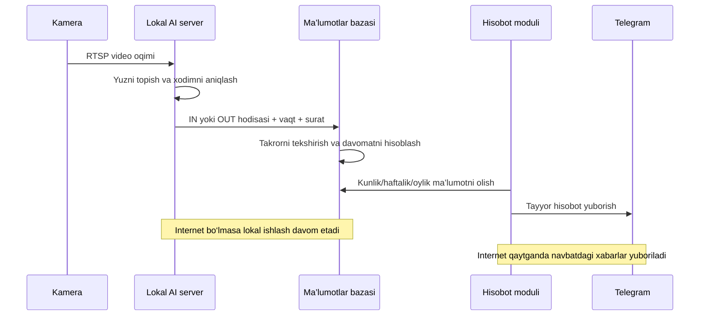

# Tomonlar mas’uliyati, arxitektura va tasklar

## Loyiha natijasi

Kamera ichidagi qo‘shimcha softga bog‘lanmagan lokal tizim:

- kirish va chiqish videosini lokal saqlaydi;
- xodimni yuzidan aniqlaydi;
- kelish, ketish va oraliq chiqib-kirishlarni qayd qiladi;
- do‘konda va tashqarida bo‘lgan vaqtni hisoblaydi;
- kunlik, haftalik va oylik hisobot yaratadi;
- hisobot va texnik ogohlantirishlarni Telegramga yuboradi;
- internet uzilsa lokal ishlashda davom etadi.

## 1. Klient tomonidan bizga kerak

### Uskuna va joy

1. Kamida 2 ta o‘rnatilgan kamera:
   - 1-kamera kirayotgan xodimning yuziga qaraydi;
   - 2-kamera chiqayotgan xodimning yuziga qaraydi.
2. CAT6 kabel va Gigabit PoE switch.
3. Kamera, switch, yozuv qurilmasi va server uchun barqaror elektr hamda UPS.
4. Lokal tarmoq va Telegram yuborish uchun internet.
5. NVR yoki video saqlash diski.
6. Biz bergan texnik talabga mos lokal server/mini-PC.
7. Montaj va sozlash vaqtida obyektga kirish ruxsati.

### Texnik ma’lumot

1. Har kameraning aniq modeli va firmware versiyasi.
2. Lokal IP manzillar.
3. Alohida yaratilgan operator login/paroli yoki sozlash vaqtida administrator kirishi.
4. RTSP/ONVIF oqimiga lokal kirish.
5. Kirish va chiqishdan kunduzgi hamda kechki test videolari.
6. Video necha kun saqlanishi: masalan, 15/30/60 kun.
7. Kamera va tarmoq uchun mas’ul texnik odamning aloqasi.

### Xodimlar haqida

1. Ism-familiya va ichki ro‘yxat.
2. Har bir xodimning old tomondan tiniq 3–5 ta yuz rasmi.
3. Har xodim odatda nechada ish boshlashi va tugatishi.
4. Dam olish kunlari va smena variantlari.
5. Kechikishga ruxsat etiladigan vaqt, agar bo‘lsa.
6. Xodimlarni video/yuz orqali aniqlash haqida xabardor qilish va kerakli rozilik.

### Hisobot bo‘yicha

1. Hisobot boradigan Telegram chat yoki kanal.
2. Kunlik hisobot yuboriladigan vaqt.
3. Haftaning qaysi kuni haftalik hisobot borishi.
4. Oylik hisobot formati: Telegram matni, Excel yoki PDF.
5. Hisobotni ko‘radigan mas’ul odam.
6. Xato hodisani kim tasdiqlashi yoki tuzatishi.

## 2. Biz tomonidan klientga beriladi

### Loyihalash

1. Joy va kamera burchagi auditi.
2. Server, disk va tarmoq bo‘yicha aniq texnik talab.
3. Kamera/IP/yo‘nalish sxemasi.
4. Yozma texnik topshiriq va qabul mezonlari.

### Lokal infratuzilma

1. Lokal serverni tayyorlash va himoyalash.
2. Kamera oqimlarini ulash.
3. Uzluksiz video yozuv yoki NVR bilan arxiv integratsiyasi.
4. Hodisa suratlari va qisqa videolarni saqlash.
5. Ma’lumotlar bazasi va avtomatik zaxira nusxa.
6. Kamera/server ishlashini kuzatish.

### AI va davomat

1. Yuzni topish va xodimlar bazasi bilan solishtirish.
2. `IN`, `OUT` va `UNKNOWN` hodisalarini yaratish.
3. Takroriy hodisalarni birlashtirish.
4. Birinchi kirish va oxirgi chiqishni aniqlash.
5. Oraliq chiqib-kirishlarni hisoblash.
6. Tashqarida va do‘konda bo‘lgan jami vaqtni hisoblash.
7. Kechikish, kelmagan kun va to‘liq bo‘lmagan hodisalarni belgilash.
8. Administratorga noto‘g‘ri hodisani tuzatish imkoniyati.

### Hisobot va foydalanish

1. Kunlik, haftalik va oylik hisobotlar.
2. Telegramga avtomatik yuborish.
3. Internet bo‘lmasa hisobotni navbatda saqlash va keyin yuborish.
4. Kamera uzilishi va tiklanishi haqida ogohlantirish.
5. Oddiy admin panel.
6. Foydalanish yo‘riqnomasi.
7. 7 kun real sinov, sozlash va topshirish.

## 3. Mas’uliyatlar chegarasi

| Ish | Klient | Biz | Kamerachi/montajchi |
|---|---:|---:|---:|
| Kamera, kabel, PoE switch va UPS xaridi | ✅ | Texnik talab | Tavsiya/yetkazish mumkin |
| Kamera montaji va kabel tortish | Nazorat/ruxsat | Burchakni tekshiradi | ✅ |
| Lokal server va disk xaridi | ✅ | Texnik parametr beradi | — |
| Tarmoq/IP/RTSP sozlash | Kirish beradi | ✅ | Yordam beradi |
| Video arxiv | Saqlash muddatini tanlaydi | ✅ sozlaydi | NVR bo‘lsa ulaydi |
| Xodimlar ro‘yxati, rasm va ish vaqti | ✅ | Bazaga kiritadi | — |
| AI, davomat va ma’lumotlar bazasi | — | ✅ | — |
| Telegram bot va hisobotlar | Chat/ruxsat beradi | ✅ | — |
| Xato hodisani tekshirish | Mas’ul odam | Tuzatish vositasini beradi | — |
| Elektr/kabel/kamera fizik nosozligi | Ta’mirni tashkil qiladi | Tashxis beradi | ✅ |
| 7 kunlik qabul testi | Natijani tasdiqlaydi | ✅ | Zarur bo‘lsa qatnashadi |

## 4. Bizning arxitektura

## 5. Ma’lumot oqimi

## 6. Tizim modullari

| Modul | Vazifasi | Natija |
|---|---|---|
| Camera Service | RTSP oqimi va kamera holati | Barqaror video manba |
| Recorder/NVR | Lokal video saqlash | Vaqt bo‘yicha topiladigan arxiv |
| Face Detection | Yuzni topish va sifatli kadr | Tanish uchun tayyor surat |
| Face Recognition | Xodimni bazadan topish | Ism yoki UNKNOWN |
| Event Service | IN/OUT va takrorlarni boshqarish | Toza hodisalar oqimi |
| Attendance Engine | Kelish-ketish va vaqt hisoblash | Kunlik davomat |
| PostgreSQL | Barcha biznes ma’lumoti | Qayta hisoblanadigan tarix |
| File Storage | Surat va qisqa video | Hodisa dalili |
| Report Service | Kun/hafta/oy agregatsiyasi | Tayyor otchot |
| Telegram Service | Xabar va fayl yuborish | Avtomatik yetkazish |
| Admin Panel | Xodim/jadval/tuzatish | Boshqaruv |
| Monitoring | Kamera, disk va server nazorati | Nosozlik ogohlantirishi |

## 7. Tasklar ro‘yxati

### EPIC 1 — Talablarni yopish

- [ ] T1.1 Xodimlar soni va smenalarni tasdiqlash.
- [ ] T1.2 Hisobot formatlari va yuborish vaqtini tasdiqlash.
- [ ] T1.3 Video saqlash muddatini tasdiqlash.
- [ ] T1.4 Qabul mezonlarini klient bilan yozma kelishish.
- [ ] T1.5 Xodimlarni xabardor qilish/rozilik masalasini yopish.

Natija: tasdiqlangan texnik topshiriq.

### EPIC 2 — Kamera va tarmoq

- [ ] T2.1 Kamera montaj burchagini tekshirish.
- [ ] T2.2 Kunduzgi va kechki 20 ta IN/20 ta OUT testini olish.
- [ ] T2.3 Statik IP va alohida parollarni sozlash.
- [ ] T2.4 Kamera, server va NVR vaqtini NTP orqali tenglashtirish.
- [ ] T2.5 RTSP/ONVIF ulanishini tekshirish.
- [ ] T2.6 Kamera uzilishi monitoringini yoqish.

Natija: serverga barqaror video beradigan kameralar.

### EPIC 3 — Lokal server va video arxiv

- [ ] T3.1 Server operatsion tizimi va Docker muhitini tayyorlash.
- [ ] T3.2 Video arxiv papkalari va disk limitini sozlash.
- [ ] T3.3 Har kamera uchun recorder yaratish.
- [ ] T3.4 Eski videoni saqlash muddatiga qarab avtomatik tozalash.
- [ ] T3.5 Hodisa suratlari va qisqa video yaratish.
- [ ] T3.6 Disk to‘lishi va recorder xatosi ogohlantirishini sozlash.

Natija: lokal va boshqariladigan video arxiv.

### EPIC 4 — Ma’lumotlar bazasi va admin

- [ ] T4.1 PostgreSQL bazasini yaratish.
- [ ] T4.2 Xodimlar, smenalar, kameralar va hodisalar jadvallarini yaratish.
- [ ] T4.3 Xodim qo‘shish/o‘chirish/nofaol qilish oynasi.
- [ ] T4.4 Ish vaqti va dam olish kunini sozlash oynasi.
- [ ] T4.5 Administrator o‘zgartirishlari jurnalini yaratish.
- [ ] T4.6 Baza va sozlamalar uchun avtomatik backup.

Natija: boshqariladigan xodimlar va hodisalar bazasi.

### EPIC 5 — Yuzni tanish va hodisalar

- [ ] T5.1 Yuzni topish pipeline’ini ulash.
- [ ] T5.2 Eng sifatli yuz kadrini tanlash.
- [ ] T5.3 Xodim yuzlarini bazaga ro‘yxatdan o‘tkazish.
- [ ] T5.4 Face Recognition va ishonch chegarasini sozlash.
- [ ] T5.5 Kamera roliga qarab IN/OUT yaratish.
- [ ] T5.6 Takroriy hodisalarni birlashtirish.
- [ ] T5.7 Ishonchi past yuzlarni UNKNOWN qilib saqlash.
- [ ] T5.8 Hodisaga surat va video havolasini biriktirish.

Natija: ism, vaqt, yo‘nalish va dalilga ega toza hodisalar.

### EPIC 6 — Davomat hisoblash

- [ ] T6.1 Birinchi IN va oxirgi OUT qoidasi.
- [ ] T6.2 Oraliq OUT→IN vaqtlarini hisoblash.
- [ ] T6.3 Do‘konda bo‘lgan jami vaqtni hisoblash.
- [ ] T6.4 Kechikish va kelmagan kunni aniqlash.
- [ ] T6.5 Tungi va bir nechta smena holatini qo‘llash.
- [ ] T6.6 IN bor/OUT yo‘q kabi xatolarni belgilash.
- [ ] T6.7 Administrator tuzatganda qayta hisoblash.

Natija: tekshiriladigan kunlik davomat.

### EPIC 7 — Hisobot va Telegram

- [ ] T7.1 Kunlik hisobot shabloni.
- [ ] T7.2 Haftalik hisobot shabloni.
- [ ] T7.3 Oylik hisobot shabloni.
- [ ] T7.4 Kerak bo‘lsa Excel/PDF eksport.
- [ ] T7.5 Telegram bot orqali avtomatik yuborish.
- [ ] T7.6 Internet uzilganda xabar navbati va qayta urinish.
- [ ] T7.7 Kamera/server/disk ogohlantirishlari.

Natija: belgilangan vaqtda avtomatik keladigan hisobotlar.

### EPIC 8 — Sinov va topshirish

- [ ] T8.1 20 ta IN va 20 ta OUT nazorat testi.
- [ ] T8.2 Bir necha chiqib-kirish testi.
- [ ] T8.3 Noma’lum yuz va takroriy kadr testi.
- [ ] T8.4 Kamera, internet va server uzilishi testi.
- [ ] T8.5 Kunlik/haftalik/oylik hisobni qo‘lda tekshirish.
- [ ] T8.6 7 kunlik real pilot.
- [ ] T8.7 Klient qabul dalolatnomasi.
- [ ] T8.8 Admin yo‘riqnomasi va texnik topshirish.

Natija: klient tasdiqlagan ishlaydigan MVP.

## 8. Muddat

| Bosqich | Taxminiy vaqt |
|---|---:|
| Talablar va texnik topshiriq | 1 kun |
| Kamera, tarmoq va arxiv | 1–2 kun |
| Server, baza va admin karkasi | 2–3 kun |
| Yuzni tanish va hodisalar | 2–3 kun |
| Davomat hisoblash | 2–3 kun |
| Hisobot va Telegram | 2–3 kun |
| Real pilot | 7 kun |

Ishlarning ayrimlari parallel bajariladi. Kamera montaji tayyor va kirishlar o‘z vaqtida berilsa, umumiy reja: **10–12 ish kuni + 7 kun sinov**.

## 9. Qabul mezonlari

1. Ikki kamera lokal tizimga uzluksiz video beradi.
2. Video kelishilgan muddat davomida saqlanadi va vaqt bo‘yicha topiladi.
3. Test IN/OUT hodisalari ism, vaqt, yo‘nalish va surat bilan yoziladi.
4. Takroriy kadrlar yangi kelish sifatida hisoblanmaydi.
5. Oraliq chiqishlar va do‘konda bo‘lgan jami vaqt to‘g‘ri hisoblanadi.
6. Kunlik, haftalik va oylik hisobotlar bazadagi hodisalar bilan mos keladi.
7. Telegram xabarlari belgilangan vaqtda boradi.
8. Kamera/internet uzilishida lokal ma’lumot yo‘qolmaydi.
9. Administrator tuzatishidan keyin hisobot qayta hisoblanadi.

## 10. Ishni boshlash tartibi

1. Klientdan uskuna, kirishlar, xodimlar va hisobot ma’lumotlarini olish.
2. Kamera burchagi va 20+20 testni tekshirish.
3. Server/diskning yakuniy parametrini berish.
4. Tomonlar mas’uliyati va qabul mezonlarini yozma tasdiqlash.
5. Lokal arxivni ishga tushirish.
6. Yuzni tanish va hodisa bazasini ishga tushirish.
7. Davomat va Telegram hisobotlarini ulash.
8. 7 kun real pilot o‘tkazish.

## 11. Klientga beriladigan qisqa otchot

> Kamera montajidan keyin tizimni lokal server asosida ishga tushiramiz. Kirish va chiqish kameralari videosi lokal arxivga yoziladi, AI esa xodimni yuzidan aniqlab kirish va chiqish hodisalarini ma’lumotlar bazasiga saqlaydi.
>
> Tizim har xodimning birinchi kelgan vaqtini, oxirgi ketgan vaqtini, kun davomida tashqariga chiqib-kirgan vaqtlarini va do‘konda bo‘lgan jami vaqtini hisoblaydi. Shu ma’lumotlardan kunlik, haftalik va oylik hisobot tayyorlanib, Telegram orqali avtomatik yuboriladi.
>
> Klient tomonidan kameralar, kabel, PoE switch, barqaror elektr/UPS, lokal server va video saqlash diski, xodimlar ro‘yxati, yuz rasmlari, ish vaqtlari hamda Telegram chat taqdim qilinadi. Server va diskni biz bergan texnik talab bo‘yicha olish kerak bo‘ladi.
>
> Biz kamera oqimlarini ulaymiz, lokal video arxivni sozlaymiz, yuzni tanish, davomat hisoblash, ma’lumotlar bazasi, admin panel va Telegram hisobot tizimini ishlab chiqamiz. Shuningdek, kamera/server uzilishi bo‘yicha ogohlantirish, 7 kunlik real test va foydalanish yo‘riqnomasini beramiz.
>
> Kamera montaji va kerakli ma’lumotlar tayyor bo‘lsa, dasturiy qism taxminan 10–12 ish kuni va 7 kun real sinovdan iborat bo‘ladi.

Bog‘liq: [[03 - Texnik arxitektura va qarorlar]] · [[04 - Ish ketma-ketligi va masuliyatlar]] · [[10 - Kamera o‘rnatilgandan keyingi lokal MVP rejasi]]
