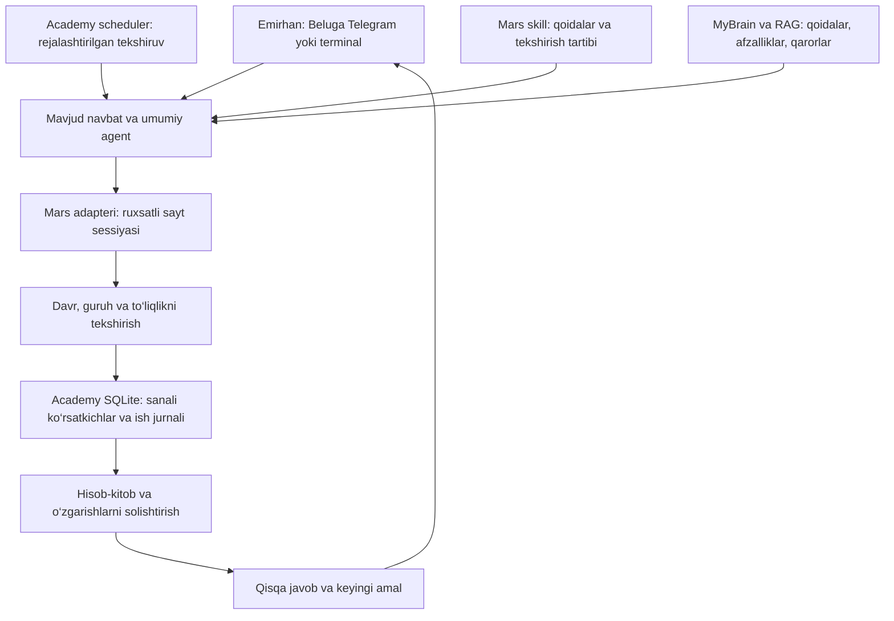

# Academy — Beluga ichidagi Mars yordamchisi

## Qaror va to‘xtash nuqtasi

Emirhan Beluga ichida Academy moduli taklifini ma’qulladi. 2026-09-08 topshirig‘i: arxitektura va takliflarni Obsidian’da to‘ldirib saqlash; implementatsiya va tuzatishlarni keyingi davom ettirishda boshlash. Hozir Academy bot, scheduler yoki Mars adapteri yaratilmagan. [foydalanuvchi tasdiqlagan]

Manbalar: [[05 - Mars Space/Mars MOC|Mars auditi]], [[03 - Areas/Codex Context/Beluga Plan|Beluga rejasi]], [[03 - Areas/Codex Context/Beluga Usage|Amaldagi Beluga qo‘llanmasi]]. 2026-09-07 kuzatuvlari tarixiy surat; keyingi ishda jonli holat qayta tekshiriladi.

## Maqsad

Bitta Telegram suhbatidan darslar, davomat, topshiriqlar, oylik va qolgan ishlarni boshqarish. Oddiy javob qisqa, tafsilot talab bo‘yicha. Owner javobi «Emirhan, …» bilan boshlanadi. Alohida Academy bot hozir zarur emas; boshqa ustozlar foydalanadigan mahsulotga aylansa alohida interfeys va foydalanuvchilar ruxsatlari ko‘rib chiqiladi.

## Tarkib va ma’lumot oqimi

- **Skill:** qaysi bo‘limni o‘qish, dalilni tekshirish, noaniq holatda nima qilishni belgilaydi. Skillning o‘zi vaqtli ishga tushirish yoki sayt ulanishi emas.
- **Adapter:** guruhlar, jadval, davomat, vazifalar va profil hisobini o‘qiydi. Hozirgi interaktiv brauzer imkoniyati fon Beluga’da borligi hali isbotlanmagan; transport tanlovi birinchi texnik tekshiruvdan keyin qilinadi. Rasmiy integratsiya mavjudligi taxmin qilinmaydi.
- **Scheduler:** Asia/Tashkent vaqtida tekshiruvlarni navbatga qo‘yadi. Uzoq terminal ishi bilan to‘qnashishni oldini oladi; alohida parallel agent dastlab shart emas. Tez status javobi uchun oxirgi tekshirilgan surat va vaqt ko‘rsatiladi.
- **SQLite:** kuzatuvlar, topshiriqlar va yuborish jurnalini saqlaydi. Minimal maydonlar: davr, guruh identifikatori, kuzatilgan vaqt, manba, qiymatlar, to‘liqlik, tasdiqlanish holati. Qayta ishga tushishda bir ish yoki xabarni takrorlamaslik uchun barqaror ish kaliti ishlatiladi.
- **RAG:** yo‘riqnoma, afzallik va qarorlarni eslaydi. Joriy oylik/davomat eski RAG parchasidan olinmaydi; bazadagi surat yoki jonli sayt o‘qishi va sanasi talab qilinadi.
- **Hisoblash:** yig‘indi, farq va qoidalar dasturda; AI tushuntirish va tavsiyada. Sayt o‘zgarmasa katta kontekstni qayta yuklamaslik token sarfini kamaytirish strategiyasi; aniq sarf hali o‘lchanmagan.

## Telegramdagi foydalanish

Asosiy tugmalar: **Bugun · Oylik · E’tibor kerak · Guruhlar**.

- «Bugun nimalarim bor?» — jadval, xona, mavzu va qolgan ishlar.
- «Oyligim nega o‘zgardi?» — bir xil davr uchun oldingi va yangi surat farqi; sabab dalili yo‘q bo‘lsa taxmin deb belgilanadi.
- «Shu guruhni ko‘rsat» — davomat, vazifa va natijalar kartochkasi.
- «20 daqiqa bo‘sh vaqtim bor» — mavjud ishlarni shoshilinchlik, o‘quvchiga foyda va taxminiy vaqt bo‘yicha saralaydi.
- «Batafsil», «Keyinroq», «Kuzatuvni pauza qil», «Davom ettir», «Oxirgi ishlar» — tafsilot, eslatma va nazorat. Vaqtli eslatma faqat scheduler saqlaganidan keyin yaratilgan deb aytiladi.

## Avtomatik otchotlar — taklif, hali yoqilmagan

| Vaqt yoki hodisa | Mazmun |
|---|---|
| Birinchi darsdan 30 daqiqa oldin | Guruhlar, mavzular, tayyorgarlik va qolgan ishlar |
| Dars tugagach | Davomat/vazifa bo‘yicha qolgan ish bo‘lsa bitta eslatma; tugash vaqti manbadan olinadi |
| Kechki yakun | Bugungi bajarilganlar, oylikdagi o‘zgarish va ertangi eng muhim 3 ish |
| Haftalik yakun | Guruhlardagi o‘sish, qo‘shimcha yordam kerak bo‘lgan holatlar va kelasi hafta rejasi |
| Oy yopilishidan oldin | Hisob-kitob holati, davomat va vazifalar bo‘yicha tekshiruv ro‘yxati |

Profil 2026-09-07 tekshiruvida 22:10 yangilanishini ko‘rsatgan; bu kafolatli tayyor vaqt emas. Hisobotdan oldin yangi qiymatlar kelgani tekshiriladi. Hisobot va sokin soatlar hali Emirhan bilan tanlanmagan. Faqat muhim o‘zgarishda qo‘shimcha xabar; bir muammoni qayta-qayta yubormaslik. Xabarlar dastlab faqat owner private chatga; ota-onalar/o‘quvchilarga tashabbusli yuborish bu reja bilan ruxsat etilmaydi.

## Hisob va nazorat qoidalari

- Oylik to‘langan darslarga bog‘liq; qatnashgan/kelmagan belgisi bilan to‘lovni tenglashtirmaslik.
- Stavka yo‘nalishga qarab farq qiladi; bitta guruh formulasini hammasiga qo‘llamaslik. Hisoblangan, tasdiqlangan va amalda to‘langan pulni ajratish; oxirgisi uchun dalil bo‘lmasa taxmin qilmaslik.
- Guruhlar jami, o‘quvchi qatorlari va gross/soliq/netto solishtiriladi; yaxlitlash bilan katta tafovutlar ajratiladi. Farqni aniqlash uning sababini isbotlamaydi.
- Eng past reyting eng katta moliyaviy imkoniyat degani emas. Prognoz faqat tasdiqlangan formula va haq to‘lanadigan hajm asosida shartli hisob sifatida beriladi.
- Oy almashtirilganda kechikib kelgan yoki aralash ma’lumotdan hisobot tuzilmaydi. Nol, yuklanmagan, topilmagan va xato holatlari alohida.
- Login sessiyasi tugasa yoki Mac uxlab qolsa holat ko‘rsatiladi; o‘tkazib yuborilgan barcha xabarlar uyg‘onganda birdan yuborilmaydi. Mac o‘chiqligida bu lokal arxitektura 24/7 ishlamaydi.
- Yozish bosqichida guruh/sana/o‘quvchi va amal aniq ko‘rsatiladi; owner topshirig‘i doirasida bajarilib, keyin qayta o‘qib tekshiriladi. Noaniq natijali yozishni ko‘r-ko‘rona qaytarmaslik. Davomat, baho yoki coin daromadni sun’iy oshirish uchun o‘zgartirilmaydi.
- Login ma’lumotlari, sessiyalar va shaxsiy o‘quvchi ma’lumotlari umumiy qaydlarga ko‘chirilmaydi. Eski MarsDC’da credential borligi oldingi auditda aniqlandi; keyingi texnik etapda tozalash va RAG indeksini tekshirish alohida ish.

## Bajarish tartibi va qabul mezonlari

1. **Ulanish tekshiruvi:** mavjud Beluga va Mars holatini tekshirish; fon agentida qonuniy brauzer sessiyasi imkoniyatini aniqlash. Telegramdagi «Oyligim» so‘rovi yangi manba, oy va vaqt bilan javob qaytarsin; javob saytga solishtirilsin.
2. **O‘qish va hisob:** guruhlar/oylik uchun tekshirilgan suratlar, o‘zgarishlar va xato holatlari. Oy almashtirish, qisman yuklanish, eskirgan surat va hisob tafovuti sinovlari.
3. **Komfort:** to‘rtta tugma va tafsilotlar; qisqa o‘zbekcha javob, typing, band holatida aniq status. Uzun kod vazifasi paytida Academy so‘rovi yo‘qolmasin.
4. **Auto-otchot:** vaqt va qamrov tanlangach scheduler, pauza, sokin soatlar va takroriy xabar himoyasi. Restart/uyqudan qaytish va noaniq yetkazish sinovlari owner chatida.
5. **Boshqaruv amallari:** kelishilgan davomat kabi amallar uchun aniq maqsad, tekshirish va ish jurnali; coin/baho amallari alohida scope.

## Keyingi suhbatda olinadigan javoblar

1. Eng ko‘p vaqtni nima oladi: vazifa tekshirish, davomat, ota-onalar bilan yozishish yoki darsga tayyorlanish?
2. Otchot dars oldidan va kechqurunmi yoki faqat bitta kechki xabarmi? Haftalik kun/vaqt va sokin soatlar qaysi?
3. Faqat o‘z guruhlarimi yoki Tutor sifatida boshqa guruhlardan keladigan qo‘shimcha darslar ham qamralsinmi?

Javoblar hali olinmagan. Keyingi safar shu uch savolni eslatish; oldingi takliflarni ishga tushgan funksiya deb aytmaslik.
